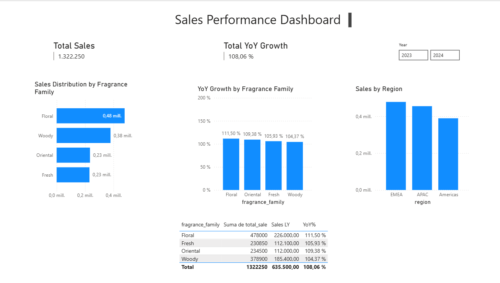

# SoulScents Analytics | Power BI

## Project Overview
SoulScents Analytics is a fictional business intelligence project built around a spiritual lifestyle brand focused on scented and wellness-inspired products.

The purpose of this project was to simulate a real-world sales analysis workflow in Power BI, from data modeling to DAX measures and dashboard design, with the goal of identifying growth patterns, regional performance, and category contribution.

## Dataset
The dataset includes:
- Sales transactions
- Product information
- Client information
- Date-based analysis through a dedicated DateTable

## Data Model
This project follows a star schema approach:
- **Fact table:** Sales
- **Dimension tables:** Products, Clients, DateTable

## Key Measures
- **Total Sales**
- **Sales LY**
- **YoY %**
- **% Sales by Fragrance Family**

## Dashboard Focus
The dashboard was designed to answer business questions such as:
- Which product families are growing versus last year?
- How are sales distributed across regions?
- What share of total sales does each fragrance family represent?

## Tools Used
- Power BI
- Power Query
- DAX

## Notes
This is a fictional portfolio project created for analytical and visualization practice.

## Author
Francesc Cebrián Ruiz

# SoulScents Analytics | Power BI

## Overview
...

